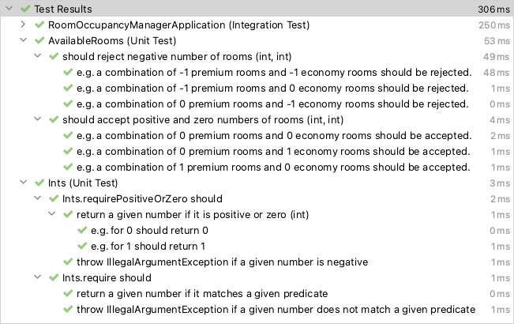

# Getting Started

## Requirements

* Java 18 - preferred way of installation is [SDKMAN!](https://sdkman.io/)

  > The project is based on Java 18, because it's the latest Java version supported by
  [Gradle](https://docs.gradle.org/current/userguide/compatibility.html) at the moment.

* [httpie](https://httpie.io/) - optional, for calling REST API. The easiest way to install on macOS is with [Homebrew](https://brew.sh/)
    ```bash
    brew install httpie
    ```

## How to build

```bash
./gradlew clean build
```

## How to run

```bash
./gradlew bootRun
```

## Calling API

```bash
echo -n '{"premiumRooms": 3, "economyRooms": 3}' | http POST localhost:8080/occupancy-plans
```

```
HTTP/1.1 200 OK
Content-Type: application/json
Content-Length: 137

{
    "premiumUsage": 3,
    "premiumAmount": {
        "amount": 738.0,
        "currency": "EUR"
    },
    "economyUsage": 3,
    "economyAmount": {
        "amount": 167.99,
        "currency": "EUR"
    }
}
```

# Notes

## Design

The application is designed with Hexagonal Architecture, which brings many benefits,
e.g. the most valuable - business - module is written in pure Java.
It doesn't have dependencies on Spring or any infrastructure. Thanks to that, it is light,
easy and fast to test and develop. Its implementation is hidden behind API (package `domain.api`),
and it is also isolated from dependencies by ports (package `domain.ports`).

## What is missing

The following things were not done due to time limitations and the project's assumptions.

* Proper support for currencies
* Comprehensive error handling for REST API
* Separate test suites for different kinds of tests (unit, integration, e2e, etc...)
* And many more...

## Git

I usually do not keep commit history in such high granulation on the master branch. Instead, during a merge to the
master,
I squash all commits from the feature branch (preferably short living) so that there is only one commit on the master
branch
that represents all the changes.

## Tests

Human-friendly test names should work in IntelliJ IDEA by default, but in the past, the following setting was needed:
> Build, Execution, Deployment -> Build Tools -> Gradle
> * Run tests using: **IntelliJ IDE**

The effect should be as the following:



## Null-Safety

I use an annotation `@NonNullApi` on a package level to instruct IDE that my code is non-nullable,
so that IDE can detect and shows warnings about nullability (static analysis). Additionally, I use Lombok `@NonNull`
to get a guaranty that I will not receive any null values. If I need to return a value which can be null:

* if it is a public API then I return an `Optional`.
* otherwise I can declare it with `@Nullable` annotation, so that IDE will not rise a warning.

This way I can get much better protection from NPE in a Java. The whole idea is described here:
[Spring Null-Safety Annotations](https://www.baeldung.com/spring-null-safety-annotations)

# Tech Stack

## Frameworks

* [Spring Reactive](https://spring.io/reactive) - a pet project like this is an excellent opportunity to try new things!

## Libraries

* [vavr](https://www.vavr.io/) - turns java™ upside down.
* [JUnit 5](https://junit.org/junit5/) - programmer-friendly testing framework for Java and the JVM.
* [AssertJ](https://assertj.github.io/doc/) - fluent assertions java library.
* [Moneta](https://javamoney.github.io/ri.html) - Reference Implementation of JSR 354 - the Java Money and Currency API for the Java™

## Tools

* [The Gradle Wrapper](https://docs.gradle.org/current/userguide/gradle_wrapper.html) - the recommended way to execute
  any Gradle build.
* [Project Lombok](https://projectlombok.org/) - Never write another getter or equals method again...
* [SpotBugs](https://spotbugs.github.io/) - a program which uses static analysis to look for bugs in Java code.
